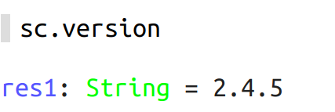

# 3 Contador de palabras

Vamos a empezar a hacer un ejercicio, un contador de palabras.

- Lo primero es ejecutar el contexto de spark
~~~scala
sc.version
~~~

- Después creamos un lista de frases.

~~~scala
val frases = List("Un día fui a comprar un ordenador", "Me dijeron que el mejor es el mac", "pero también me dijeron que es el más caro", "Al final decicí por comprarme el mac", "pagué el precio y ahora estoy muy contento")
~~~

- Ahora vamos a funsionar spark y scala. 
Pedimo a spark que suba a memoria la colección de frases, ya que spark trabaja en memoria.

~~~scala
val texto = sc.parallelize(frases)
~~~

- Ahora toca contar palabras
    
    1º  pasamos la líneas a minúsculas
    ~~~scala
    toLowerCase
    ~~~
    2º dividimos las frases en palabras con una expresión regular
    ~~~scala
    split("\\W+")
    ~~~
    3º y el resultado lo presentamos en una tupla, (palbara, 1)
    ~~~scala
    map(pal => (pal ,1))
    ~~~
    4º Hacemos un conteo clave/valor con reduceByKey
    ~~~scala
    reduceByKey(_+_)
    ~~~

    ~~~scala
    val numPalabras = texto.flatMap(line => line.toLowerCase.split("\\W+")).map(pal => (pal ,1)).reduceByKey(_+_)
    ~~~
    5º Obtenemos un RDD (Resilient Distributed Dataset) al cual le podemos hacer operaciones.
    
